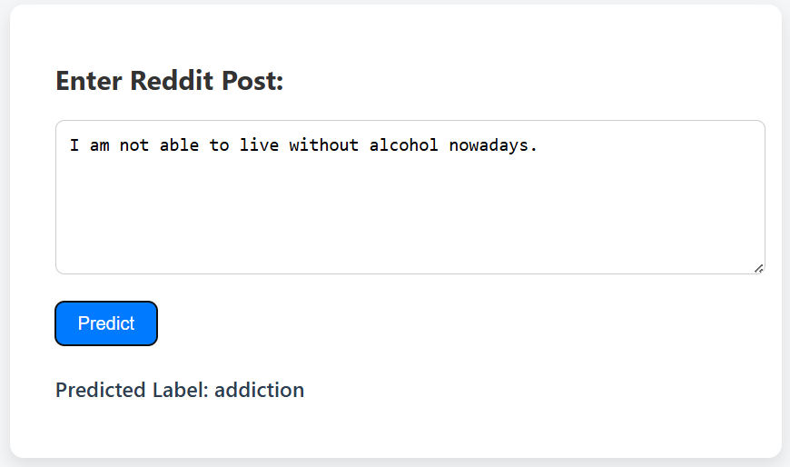
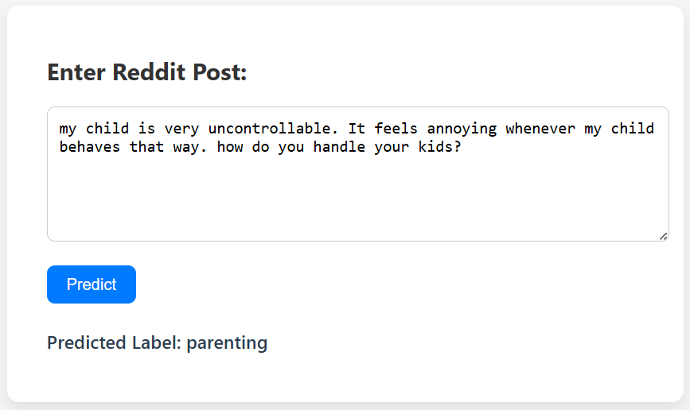

# Mental Health Prediction from Reddit Posts

This project is a machine learning-based text classification system that predicts the subreddit category of Reddit posts, focusing on mental health discussions.  
Built with Python and Flask, the system uses **NLP preprocessing** and a **Random Forest Classifier** to analyze text and provide real-time predictions.

---

## Features
- Classifies Reddit posts into their respective subreddit categories.
- Text preprocessing with stopword removal, punctuation cleaning, and TF-IDF vectorization.
- Robust prediction using **Random Forest Classifier**.
- RESTful API for real-time predictions via Flask.
- Easily deployable for demonstration purposes.

---

## Model Overview
- **Algorithm**: Random Forest Classifier (`sklearn.ensemble`)
- **Input Features**: TF-IDF vectorized text data
- **Training Data**: Cleaned Reddit posts with subreddit labels
- **Deployment**: Flask web framework with `/predict` API endpoint

---

## Screenshots

### Web Interface

### Prediction Result Example

git clone <your-repo-link>
cd <repo-folder>
